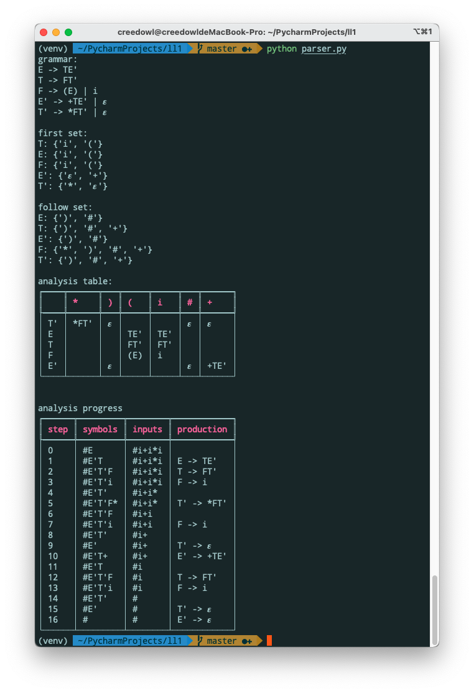

# LL(1) Parser

This is a toy LL(1) parser written in Python. It can now eliminate the left recursion, calculate First set and Follow set,
create analysis table and generate analysis progress.

## How to use

```shell script
pip install -r requirement.txt
python parser.py
```

The grammar is in `in.txt`, you can change it and don't forget to change the input string in `parser.py`

## Example



## Reference

> [lr1-parser](https://github.com/queensferryme/lr1-parser)